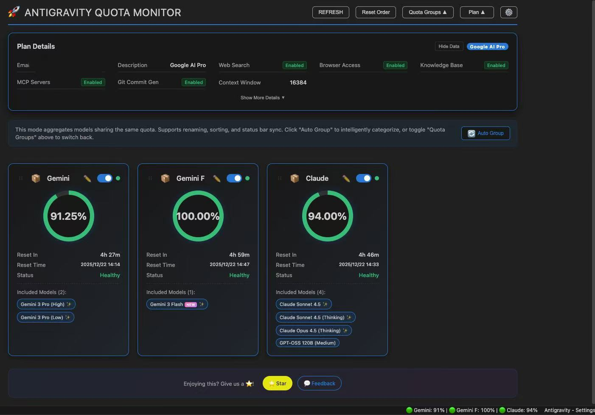

# AG Pro

[English](README.en.md) · 简体中文

[](https://github.com/yourusername/ag-pro)
[](LICENSE.txt)

VS Code 扩展，用于监控 Google Antigravity AI 模型配额。基于 [Antigravity Cockpit](https://github.com/jlcodes99/vscode-antigravity-cockpit) 二次开发。

**功能**：Webview 仪表盘 · QuickPick 模式 · 配额分组 · 自动分组 · 重命名 · 卡片视图 · 拖拽排序 · 状态栏监控 · 阈值通知 · 隐私模式 · 无缝切换账号

**语言**：跟随 VS Code 语言设置，支持 16 种语言

🇺🇸 English · 🇨🇳 简体中文 · 繁體中文 · 🇯🇵 日本語 · 🇩🇪 Deutsch · 🇪🇸 Español · 🇫🇷 Français · 🇮🇹 Italiano · 🇰🇷 한국어 · 🇧🇷 Português · 🇷🇺 Русский · 🇹🇷 Türkçe · 🇵🇱 Polski · 🇨🇿 Čeština · 🇸🇦 العربية · 🇻🇳 Tiếng Việt

---

## ✨ 新特性

相比原版 Antigravity Cockpit，AG Pro 增强了以下功能：

- 🚀 **无缝账号切换**：快捷键 `Ctrl/Cmd+Shift+A` 快速切换账号，无需重启客户端
- 🎨 **全新品牌设计**：现代化 UI 设计，更清爽的视觉体验
- ⚡ **性能优化**：更快的响应速度和更流畅的交互
- 🔧 **增强稳定性**：修复已知问题，提升整体稳定性

---

## 功能概览

### 显示模式

提供两种显示模式，可在设置中切换 (`agCockpit.displayMode`)：

#### Webview 仪表盘



- **卡片视图**：卡片布局展示模型配额
- **分组模式**：按配额池聚合模型，显示分组配额
- **非分组模式**：显示单个模型配额
- **拖拽排序**：拖动卡片调整显示顺序
- **自动分组**：根据配额池自动归类模型

#### QuickPick 模式


使用 VS Code 原生 QuickPick API，适用于：
- Webview 无法加载的环境
- 偏好键盘操作的用户
- 需要快速查看配额

功能：
- 支持分组 / 非分组模式
- 标题栏按钮：刷新、切换分组、打开日志、设置、切换到 Webview
- 置顶模型到状态栏
- 重命名模型和分组

---

### 状态栏

显示当前监控模型的配额状态。支持 6 种格式：

| 格式 | 示例 |
|------|------|
| 仅图标 | `🚀` |
| 仅状态点 | `🟢` / `🟡` / `🔴` |
| 仅百分比 | `95%` |
| 状态点 + 百分比 | `🟢 95%` |
| 名称 + 百分比 | `Sonnet: 95%` |
| 完整显示 | `🟢 Sonnet: 95%` |

- **多模型置顶**：可同时监控多个模型
- **自动监控**：未指定模型时，自动显示剩余配额最低的模型

---

### 配额显示

每个模型 / 分组显示：
- **剩余配额百分比**
- **倒计时**：如 `4h 40m`
- **重置时间**：如 `15:16`
- **进度条**：可视化剩余配额

---

### 配额来源（本地 / 授权）

支持两种配额来源，可在面板右上角随时切换：

- **本地监控**：读取本地 Antigravity 客户端进程，更稳定但需要客户端运行
- **授权监控**：通过授权访问远端接口获取配额，不依赖本地进程，适合 API 中转或无客户端场景
- **多账号授权**：授权监控支持多个账号，支持切换当前账号与状态展示
- **切换提示**：切换过程中会显示加载/超时提示，网络异常时可切回本地

---

### 无缝账号切换 🔥

**快捷键**：`Ctrl/Cmd+Shift+A`

快速切换 Antigravity 账号，无需手动重启客户端：
- 自动检测本地已授权账号
- 一键切换，自动重启客户端
- 支持从 Antigravity Tools 导入账号
- 账号列表侧边栏管理

---

### 自动唤醒 (Auto Wake-up)

设置定时任务，提前唤醒 AI 模型，触发配额重置周期。

- **灵活调度**：支持每天、每周、间隔循环和高级 Crontab 模式
- **多模型支持**：同时唤醒多个模型
- **多账号授权**：支持多个账号授权、切换当前账号、查看账号状态
- **账号管理**：新增授权管理弹窗，可重新授权或移除账号
- **安全保障**：凭证加密存储于 VS Code Secret Storage，本地运行
- **历史记录**：查看详细的触发日志和 AI 响应
- **使用场景**：上班前自动唤醒，利用闲置时间跑完重置 CD

---

## 使用

### 打开仪表盘

- 点击状态栏图标
- 或 `Ctrl/Cmd+Shift+Q`
- 或命令面板运行 `AG Pro: Open AG Pro Dashboard`

### 无缝切换账号

- 快捷键 `Ctrl/Cmd+Shift+A`
- 或命令面板运行 `AG Pro: Seamless Switch Account`
- 选择目标账号，自动完成切换

### 刷新配额

- 点击刷新按钮
- 或 `Ctrl/Cmd+Shift+R`（仪表盘激活时）

### 故障排查

- "Systems Offline" 时点击 Retry Connection
- 点击 Open Logs 查看调试日志

---

## 配置项

| 配置 | 默认值 | 说明 |
|------|--------|------|
| agCockpit.displayMode | webview | 显示模式：webview / quickpick |
| agCockpit.refreshInterval | 120 | 刷新间隔（秒，10-3600） |
| agCockpit.statusBarFormat | standard | 状态栏格式 |
| agCockpit.groupingEnabled | true | 启用分组模式 |
| agCockpit.warningThreshold | 30 | 警告阈值（%） |
| agCockpit.criticalThreshold | 10 | 危险阈值（%） |
| agCockpit.notificationEnabled | true | 启用通知 |
| agCockpit.quotaSource | authorized | 配额来源：local / authorized |
| agCockpit.profileHidden | false | 隐藏计划详情面板 |
| agCockpit.dataMasked | false | 脱敏敏感数据 |

---

## 安装

### 方式 1：VSIX 文件安装

1. 下载最新的 `ag-pro-x.x.x.vsix` 文件
2. 打开 VS Code
3. 按 `Ctrl/Cmd+Shift+P` 打开命令面板
4. 输入 `Extensions: Install from VSIX...`
5. 选择下载的 VSIX 文件

或使用命令行：

```bash
code --install-extension ag-pro-1.0.0.vsix
```

### 方式 2：从源码构建

```bash
# 克隆仓库
git clone https://github.com/yourusername/ag-pro.git
cd ag-pro

# 安装依赖
npm install

# 编译
npm run build:prod

# 打包
npm run package
```

要求：Node.js v18+, npm v9+

---

## 快捷键

| 快捷键 | 功能 |
|--------|------|
| `Ctrl/Cmd+Shift+Q` | 打开 AG Pro 仪表盘 |
| `Ctrl/Cmd+Shift+A` | 无缝切换账号 |
| `Ctrl/Cmd+Shift+R` | 刷新配额（仪表盘激活时） |

---

## 更新日志

查看 [CHANGELOG.md](CHANGELOG.md) 了解详细更新记录。

---

## 致谢

本项目基于 [Antigravity Cockpit](https://github.com/jlcodes99/vscode-antigravity-cockpit) 二次开发，感谢原作者的开源贡献！

同时感谢以下项目：
- [Antigravity Quota](https://github.com/example/antigravity-quota) - 进程检测逻辑参考
- [AntigravityQuotaWatcher](https://github.com/example/watcher) - 监控机制参考

如果这些项目对你有帮助，请给他们点个 ⭐ Star 支持！

---

## 支持项目

如果 AG Pro 对你有帮助，欢迎：

- ⭐ 给项目点个 Star
- 🐛 提交 Issue 反馈问题
- 💡 提交 Pull Request 贡献代码
- 📢 分享给更多人

---

## 许可证

MIT License

---

## 免责声明

本项目仅供个人学习和研究使用。使用本项目即表示您同意：

- 不将本项目用于任何商业用途
- 承担使用本项目的所有风险和责任
- 遵守相关服务条款和法律法规

项目作者对因使用本项目而产生的任何直接或间接损失不承担责任。

---

## 联系方式

- GitHub Issues: [提交问题](https://github.com/yourusername/ag-pro/issues)
- 项目主页: [AG Pro](https://github.com/yourusername/ag-pro)

---

**Enjoy coding with AG Pro! 🚀**
